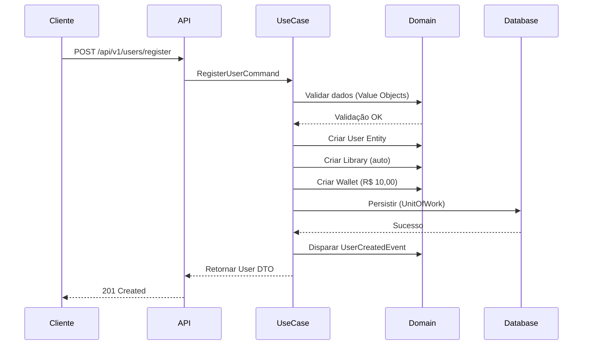
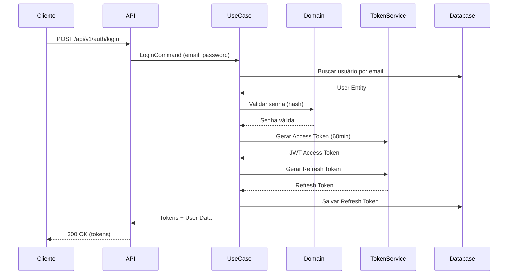
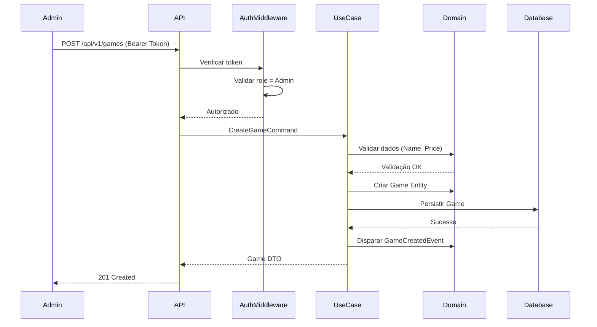
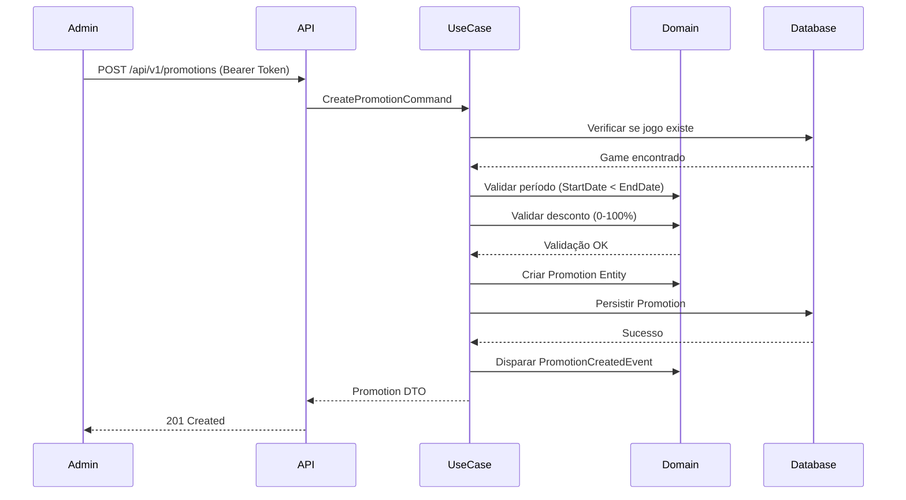
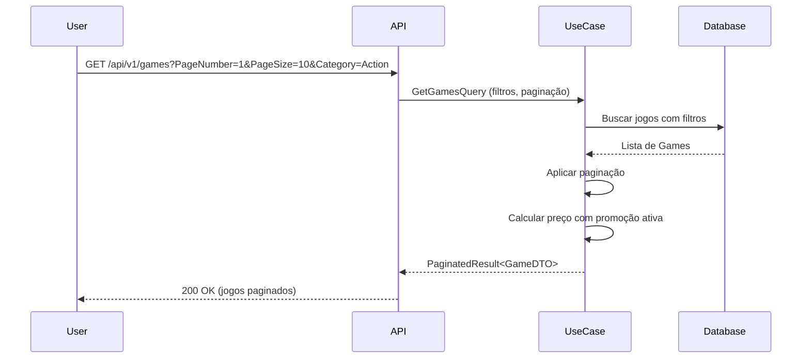
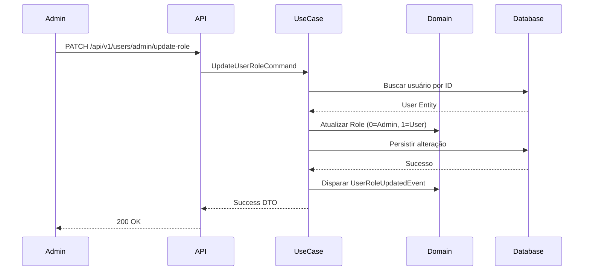

# 🎮 FCG - Free Clean Games Platform

> **Plataforma de gerenciamento de jogos digitais desenvolvida em .NET 8 com Clean Architecture**

[](https://dotnet.microsoft.com/)
[](https://www.docker.com/)
[](LICENSE)

---

## 📋 Índice

- [Sobre o Projeto](#-sobre-o-projeto)
- [Arquitetura e Padrões](#-arquitetura-e-padrões)
- [Fluxo da Aplicação](#-fluxo-da-aplicação)
- [Regras de Negócio](#-regras-de-negócio)
- [Tecnologias Utilizadas](#-tecnologias-utilizadas)
- [Pré-requisitos](#-pré-requisitos)
- [Instalação e Execução](#-instalação-e-execução)
- [Endpoints da API](#-endpoints-da-api)
- [Testes](#-testes)
- [Estrutura do Projeto](#-estrutura-do-projeto)
- [Documentação Adicional](#-documentação-adicional)
- [Grupo e Participantes](#-grupo-e-participantes)

---

## 🎯 Sobre o Projeto

O **FCG** é uma plataforma de gerenciamento de jogos digitais que permite:

- 👤 **Cadastro e autenticação** de usuários com JWT
- 🎮 **Catálogo de jogos** com gerenciamento por administradores
- 💰 **Sistema de carteira virtual** (saldo inicial de R$ 10,00)
- 📚 **Biblioteca pessoal** de jogos adquiridos
- 🎁 **Sistema de promoções** com descontos temporários
- 🔐 **Controle de acesso** baseado em roles (Admin/User)

### Objetivos do Projeto

Este projeto foi desenvolvido como parte do **Tech Challenge da FIAP**, com foco em:

1. ✅ Demonstrar a aplicação de **Clean Architecture** e **SOLID**
2. ✅ Implementar **Domain-Driven Design (DDD)**
3. ✅ Aplicar o padrão **CQRS** com MediatR
4. ✅ Garantir **testabilidade** (testes unitários, integrados e funcionais)
5. ✅ Utilizar **Docker** para containerização
6. ✅ Documentar adequadamente a solução

---

## 🏗️ Arquitetura e Padrões

### Clean Architecture

O projeto segue a **Clean Architecture** com separação clara de responsabilidades:

```
┌─────────────────────────────────────────┐
│           FCG.WebApi                    │  ← Camada de Apresentação
│    (Controllers, Middlewares)           │
└────────────────┬────────────────────────┘
                 │
┌────────────────▼────────────────────────┐
│        FCG.Application                  │  ← Camada de Aplicação
│    (Use Cases, Handlers, Events)        │
└────────────────┬────────────────────────┘
                 │
┌────────────────▼────────────────────────┐
│          FCG.Domain                     │  ← Camada de Domínio
│  (Entities, Value Objects, Interfaces)  │
└────────────────┬────────────────────────┘
                 │
┌────────────────▼────────────────────────┐
│       FCG.Infrastructure                │  ← Camada de Infraestrutura
│   (Persistence, Services, Migrations)   │
└─────────────────────────────────────────┘
```

### Padrões Implementados

- **SOLID Principles**: Aplicados em todas as camadas
- **CQRS (Command Query Responsibility Segregation)**: Separação entre comandos e consultas
- **Repository Pattern**: Abstração da persistência de dados
- **Unit of Work**: Gerenciamento de transações
- **Domain Events**: Comunicação desacoplada entre agregados
- **Value Objects**: Encapsulamento de lógica de validação
- **Dependency Injection**: Inversão de controle
- **Mediator Pattern**: Comunicação através do MediatR

---

## 🔄 Fluxo da Aplicação

### 1️⃣ Fluxo de Registro de Usuário



**Regras aplicadas:**
- ✅ Email deve ser único e válido
- ✅ Senha deve ter no mínimo 8 caracteres, letras e números
- ✅ Library é criada automaticamente
- ✅ Wallet iniciada com R$ 10,00
- ✅ Role padrão: User (1)

---

### 2️⃣ Fluxo de Autenticação (Login)



**Regras aplicadas:**
- ✅ Email deve existir
- ✅ Senha deve corresponder ao hash armazenado
- ✅ Access Token expira em 60 minutos
- ✅ Refresh Token permite renovação sem re-login

---

### 3️⃣ Fluxo de Cadastro de Jogo (Admin)



**Regras aplicadas:**
- ✅ Apenas Admin pode cadastrar jogos
- ✅ Nome do jogo deve ter entre 3 e 200 caracteres
- ✅ Preço deve ser maior que zero
- ✅ Categoria é obrigatória

---

### 4️⃣ Fluxo de Criação de Promoção (Admin)



**Regras aplicadas:**
- ✅ Apenas Admin pode criar promoções
- ✅ Jogo deve existir
- ✅ Data de fim deve ser posterior à data de início
- ✅ Desconto entre 0% e 100%

---

### 5️⃣ Fluxo de Listagem de Jogos (User)



**Regras aplicadas:**
- ✅ User autenticado pode listar jogos
- ✅ Suporte a filtro por categoria
- ✅ Paginação com PageNumber e PageSize
- ✅ Preço exibido considera promoção ativa (se houver)

---

### 6️⃣ Fluxo de Atualização de Role (Admin)



**Regras aplicadas:**
- ✅ Apenas Admin pode alterar roles
- ✅ Role deve ser 0 (Admin) ou 1 (User)
- ✅ Usuário deve existir

---

## 📜 Regras de Negócio

### 🔐 Autenticação e Autorização

| Regra | Descrição |
|-------|-----------|
| **RN001** | Email deve ser único no sistema |
| **RN002** | Senha deve ter no mínimo 8 caracteres, incluindo letras e números |
| **RN003** | Access Token expira em 60 minutos |
| **RN004** | Refresh Token permite renovação sem re-login |
| **RN005** | Existem dois níveis de acesso: Admin (0) e User (1) |
| **RN006** | Role padrão no cadastro: User (1) |

### 👤 Gestão de Usuários

| Regra | Descrição |
|-------|-----------|
| **RN007** | Ao registrar, uma Library é criada automaticamente |
| **RN008** | Ao registrar, uma Wallet é criada com saldo de R$ 10,00 |
| **RN009** | Usuário pode atualizar apenas sua própria senha |
| **RN010** | Apenas Admin pode alterar roles de outros usuários |
| **RN011** | Apenas Admin pode listar todos os usuários |

### 🎮 Gestão de Jogos

| Regra | Descrição |
|-------|-----------|
| **RN012** | Apenas Admin pode cadastrar jogos |
| **RN013** | Nome do jogo deve ter entre 3 e 200 caracteres |
| **RN014** | Preço do jogo deve ser maior que zero |
| **RN015** | Categoria é obrigatória |
| **RN016** | Usuários autenticados podem listar jogos |

### 🎁 Sistema de Promoções

| Regra | Descrição |
|-------|-----------|
| **RN017** | Apenas Admin pode criar promoções |
| **RN018** | Promoção deve estar vinculada a um jogo existente |
| **RN019** | Data de fim deve ser posterior à data de início |
| **RN020** | Desconto deve estar entre 0% e 100% |
| **RN021** | Promoção é aplicada automaticamente se estiver no período válido |

### 📚 Biblioteca e Carteira

| Regra | Descrição |
|-------|-----------|
| **RN022** | Todo usuário possui uma Library única |
| **RN023** | Library armazena os jogos adquiridos (LibraryGame) |
| **RN024** | Todo usuário possui uma Wallet única |
| **RN025** | Saldo inicial da Wallet é R$ 10,00 |

---

## 🛠️ Tecnologias Utilizadas

### Backend

- **.NET 8** - Framework principal
- **C# 12** - Linguagem de programação
- **Entity Framework Core** - ORM para acesso a dados
- **MediatR** - Implementação do padrão Mediator (CQRS)
- **FluentValidation** - Validação de modelos
- **Serilog** - Logging estruturado
- **Seq** - Agregação e visualização de logs

### Autenticação e Segurança

- **JWT (JSON Web Tokens)** - Autenticação stateless
- **BCrypt.Net** - Hashing de senhas
- **ASP.NET Core Identity** - Gestão de identidade

### Banco de Dados

- **SQL Server 2022** - Banco de dados relacional
- **Entity Framework Core Migrations** - Versionamento do schema

### Containerização

- **Docker** - Containerização da aplicação
- **Docker Compose** - Orquestração de containers

### Testes

- **xUnit** - Framework de testes
- **FluentAssertions** - Assertions fluentes
- **Moq** - Mock de dependências
- **Bogus** - Geração de dados fake
- **Reqnroll** - BDD (Behavior-Driven Development)
- **Microsoft.AspNetCore.Mvc.Testing** - Testes de integração

### Documentação

- **Swagger/OpenAPI** - Documentação interativa da API
- **Markdown** - Documentação em texto

---

## 📋 Pré-requisitos

Antes de começar, certifique-se de ter instalado:

- **[.NET 8 SDK](https://dotnet.microsoft.com/download/dotnet/8.0)** (versão 8.0 ou superior)
- **[Docker Desktop](https://www.docker.com/products/docker-desktop)** (para execução com containers)
- **[Git](https://git-scm.com/)** (para clonar o repositório)
- **[Visual Studio 2022](https://visualstudio.microsoft.com/)** ou **[Visual Studio Code](https://code.visualstudio.com/)** (opcional)

### Verificar Instalações

```bash
# Verificar .NET
dotnet --version

# Verificar Docker
docker --version
docker-compose --version
```

---

## 🚀 Instalação e Execução

### Opção 1: Executar com Docker (Recomendado)

#### 1. Clonar o Repositório

```bash
git clone https://github.com/group10-tc-01/FCG-group10.git
cd FCG-group10
```

#### 2. Executar com Docker Compose

```bash
# Build e iniciar todos os containers
docker-compose up --build

# Ou executar em background
docker-compose up -d --build
```

#### 3. Aguardar Inicialização

Aguarde alguns segundos até que todos os serviços estejam prontos:

- ✅ SQL Server: `localhost:1433`
- ✅ API: `http://localhost:8080`
- ✅ Swagger: `http://localhost:8080/swagger`
- ✅ Seq (Logs): `http://localhost:5342`

#### 4. Aplicar Migrations (Primeira Execução)

```bash
# Executar migrations no container
docker exec -it api-fcg dotnet ef database update
```

#### 5. Acessar a Aplicação

- **Swagger UI**: http://localhost:8080/swagger
- **Health Check**: http://localhost:8080/health
- **Seq Dashboard**: http://localhost:5342 (user: admin, password: YourPassword123)

---

### Opção 2: Executar Localmente (Sem Docker)

#### 1. Clonar o Repositório

```bash
git clone https://github.com/group10-tc-01/FCG-group10.git
cd FCG-group10
```

#### 2. Configurar SQL Server

Certifique-se de ter um SQL Server local em execução ou atualize a connection string em:

- `src/FCG.WebApi/appsettings.Development.json`

```json
{
  "ConnectionStrings": {
    "DefaultConnection": "Server=localhost,1433;Database=fcg_database;User Id=sa;Password=YourPassword123;TrustServerCertificate=True;"
  }
}
```

#### 3. Restaurar Dependências

```bash
dotnet restore
```

#### 4. Aplicar Migrations

```bash
cd src/FCG.WebApi
dotnet ef database update --project ../FCG.Infrastructure
```

#### 5. Executar a API

```bash
dotnet run --project src/FCG.WebApi/FCG.WebApi.csproj
```

#### 6. Acessar a Aplicação

- **Swagger UI**: https://localhost:7071/swagger
- **Health Check**: https://localhost:7071/health

---

## 📡 Endpoints da API

### Base URL

```
http://localhost:8080/api/v1
```

### Resumo dos Endpoints

| Método | Endpoint | Autenticação | Descrição |
|--------|----------|--------------|-----------|
| **Autenticação** | | | |
| `POST` | `/auth/login` | ❌ | Login de usuário |
| `POST` | `/auth/refresh-token` | ❌ | Renovar access token |
| `POST` | `/auth/logout` | ✅ User/Admin | Logout (invalida tokens) |
| **Usuários** | | | |
| `POST` | `/users/register` | ❌ | Registrar novo usuário |
| `PUT` | `/users/{id}` | ✅ User/Admin | Atualizar senha |
| `PATCH` | `/users/admin/update-role` | ✅ Admin | Alterar role de usuário |
| **Administração** | | | |
| `GET` | `/admin/users` | ✅ Admin | Listar todos os usuários (paginado) |
| `GET` | `/admin/users/{id}` | ✅ Admin | Buscar usuário por ID |
| **Jogos** | | | |
| `POST` | `/games` | ✅ Admin | Cadastrar novo jogo |
| `GET` | `/games` | ✅ User/Admin | Listar jogos (paginado, com filtros) |
| **Promoções** | | | |
| `POST` | `/promotions` | ✅ Admin | Criar promoção |
| **Health** | | | |
| `GET` | `/health` | ❌ | Verificar saúde da API |

### Autenticação

Para endpoints protegidos, inclua o token JWT no header:

```http
Authorization: Bearer {accessToken}
```

---

## 🧪 Testes

O projeto possui cobertura completa de testes em três níveis:

### 1. Testes Unitários (`FCG.UnitTests`)

Testam componentes isolados (entidades, value objects, handlers).

```bash
# Executar testes unitários
dotnet test tests/FCG.UnitTests/FCG.UnitTests.csproj

# Com cobertura de código
dotnet test tests/FCG.UnitTests/FCG.UnitTests.csproj --collect:"XPlat Code Coverage"
```

**Exemplos de testes:**
- Validação de Value Objects (Email, Name, Price)
- Lógica de entidades (User, Game, Promotion)
- Handlers de casos de uso

### 2. Testes de Integração (`FCG.IntegratedTests`)

Testam a integração entre camadas (API → Application → Infrastructure).

```bash
# Executar testes de integração
dotnet test tests/FCG.IntegratedTests/FCG.IntegratedTests.csproj
```

**Exemplos de testes:**
- Controllers com banco de dados in-memory
- Fluxos completos de autenticação
- Persistência de dados

### 3. Testes Funcionais (`FCG.FunctionalTests`)

Testes BDD (Behavior-Driven Development) com Reqnroll.

```bash
# Executar testes funcionais
dotnet test tests/FCG.FunctionalTests/FCG.FunctionalTests.csproj
```

**Exemplos de testes:**
- Cenários de negócio em Gherkin
- Fluxos end-to-end
- Validação de regras de negócio

### Executar Todos os Testes

```bash
# Executar toda a suite de testes
dotnet test

# Com relatório detalhado
dotnet test --logger "console;verbosity=detailed"

# Com cobertura de código
dotnet test --collect:"XPlat Code Coverage"
```

### Estrutura de Testes

```
tests/
├── FCG.UnitTests/              # Testes unitários
│   ├── Domain/                 # Testes de entidades e VOs
│   ├── Application/            # Testes de handlers
│   └── Services/               # Testes de serviços
├── FCG.IntegratedTests/        # Testes de integração
│   ├── Controllers/            # Testes de API
│   └── Configurations/         # Configurações de teste
├── FCG.FunctionalTests/        # Testes funcionais (BDD)
│   ├── Features/               # Arquivos .feature (Gherkin)
│   └── Steps/                  # Step definitions
└── FCG.CommomTestsUtilities/   # Utilitários compartilhados
    └── Builders/               # Builders para testes
```

---

## 📂 Estrutura do Projeto

```
FCG-group10/
├── src/
│   ├── FCG.Domain/                    # Camada de Domínio
│   │   ├── Entities/                  # Entidades de domínio
│   │   ├── ValueObjects/              # Value Objects
│   │   ├── Events/                    # Eventos de domínio
│   │   ├── Repositories/              # Interfaces de repositórios
│   │   ├── Exceptions/                # Exceções customizadas
│   │   └── Enum/                      # Enumeradores
│   │
│   ├── FCG.Application/               # Camada de Aplicação
│   │   ├── UseCases/                  # Casos de uso (CQRS)
│   │   │   ├── Authentication/        # Login, RefreshToken, Logout
│   │   │   ├── Users/                 # Registro, Atualização
│   │   │   ├── Games/                 # CRUD de jogos
│   │   │   ├── Promotions/            # Gestão de promoções
│   │   │   ├── Admin/                 # Operações administrativas
│   │   │   └── Library/               # Gestão de biblioteca
│   │   ├── EventsHandlers/            # Handlers de eventos
│   │   └── DependencyInjection/       # Configuração de DI
│   │
│   ├── FCG.Infrastructure/            # Camada de Infraestrutura
│   │   ├── Persistence/               # Contexto EF Core
│   │   │   ├── Context/               # DbContext
│   │   │   ├── Configurations/        # Fluent API
│   │   │   └── Repositories/          # Implementações
│   │   ├── Services/                  # Serviços externos
│   │   ├── Migrations/                # Migrations do EF
│   │   └── DependencyInjection/       # Configuração de DI
│   │
│   ├── FCG.WebApi/                    # Camada de Apresentação
│   │   ├── Controllers/               # Controllers REST
│   │   │   └── v1/                    # Versionamento da API
│   │   ├── Middlewares/               # Middlewares customizados
│   │   ├── Filter/                    # Filtros de ação
│   │   ├── Attributes/                # Atributos customizados
│   │   ├── Models/                    # DTOs de request/response
│   │   └── DependencyInjection/       # Configuração de DI
│   │
│   └── FCG.Messages/                  # Recursos de mensagens (i18n)
│       └── ResourceMessages.resx      # Mensagens em português
│
├── tests/
│   ├── FCG.UnitTests/                 # Testes unitários
│   ├── FCG.IntegratedTests/           # Testes de integração
│   ├── FCG.FunctionalTests/           # Testes funcionais (BDD)
│   └── FCG.CommomTestsUtilities/      # Utilitários de teste
│
├── docker-compose.yml                 # Orquestração Docker
├── FCG.sln                            # Solution .NET
├── FCG-API-Documentation.md           # Documentação completa da API
└── README.md                          # Este arquivo
```

---

## 📚 Documentação Adicional

- **[Documentação Completa da API](FCG-API-Documentation.md)** - Especificação detalhada de todos os endpoints
- **[Swagger UI](http://localhost:8080/swagger)** - Documentação interativa (quando a API estiver em execução)

---

## 👥 Grupo e Participantes

### Grupo 10 - Tech Challenge FIAP

| Nome | Discord Username | GitHub | Role |
|------|-----------------|--------|------|
| **Flávio José da Costa Filho** | @flaviojcf | [@flaviojcf](https://github.com/flaviojcf) | Developer |
| **Rhuan Marques De Araújo** | @rhuanmarques | [@Rhuaannn](https://github.com/rhuaannn) | Developer |
| **Lohhan Guilherme Bibiano da Silva** | @_bibiano | [@lohhan](https://github.com/lohhan) | Developer |

### Links do Projeto

- 🔗 **Repositório**: https://github.com/group10-tc-01/FCG-group10
- 📄 **Documentação**: [FCG-API-Documentation.md](FCG-API-Documentation.md)
- 🎥 **Vídeo Demonstração**: [Link do YouTube](#) _(a ser adicionado)_

---

## 📝 Licença

Este projeto foi desenvolvido para fins educacionais como parte do Tech Challenge da FIAP.

---

## 📧 Contato

Para dúvidas ou sugestões, entre em contato através do Discord ou abra uma issue no GitHub.

---
